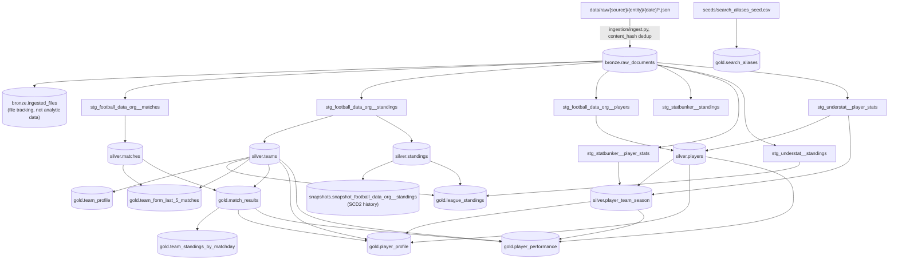

# Data Pipeline Table Relationships

This document maps every table in the pipeline (Bronze → staging → Silver →
Gold, plus seeds and the SCD2 snapshot) and how they relate to each other:
which column joins to which, what the join direction/cardinality is, and
which seed resolves which gap. It complements
[`docs/gold_data_contract.md`](gold_data_contract.md) (column-by-column
meaning of the gold tables) by focusing on the *relationships between*
tables rather than the meaning of individual columns.

General anchor rule that governs almost every join below: **`team_id` and
`player_id` are always football_data_org's numeric ids** (or, for
`player_id`, an understat id + `100000000` offset when no football_data_org
row exists — see `silver.players`). Nothing in silver/gold ever joins on
`team_name`/`player_name` — those only appear as denormalized display
columns.

---

## 1. Layer overview

The four physical layers, in order:

| Layer | Schema | Storage | Refresh trigger |
|---|---|---|---|
| Raw files | `data/raw/` (filesystem, not DB) | JSON | Crawler run |
| Bronze | `bronze` (Postgres) | Raw JSONB + metadata | `ingestion/ingest.py` |
| Staging + Silver | `silver` (Postgres, via dbt) | Typed/deduped/unified | `dbt run` / `dbt build` |
| Gold | `gold` (Postgres, via dbt) | Flat, business-ready | `dbt run` / `dbt build` |

---

## 2. Bronze layer

### `bronze.raw_documents`
The single landing table for **all** sources and entity types — not split
per source. Every staging model reads from this same table, filtered by
`source` + `entity_type`:

| `source` | `entity_type` | Consumed by |
|---|---|---|
| `football_data_org` | `matches` | `stg_football_data_org__matches` |
| `football_data_org` | `standings` | `stg_football_data_org__standings` |
| `football_data_org` | `players` | `stg_football_data_org__players` |
| `statbunker` | `standings` | `stg_statbunker__standings` |
| `statbunker` | `player_stats` | `stg_statbunker__player_stats` |
| `understat` | `standings` | `stg_understat__standings` |
| `understat` | `player_stats` | `stg_understat__player_stats` |

No foreign keys — `raw_documents` has no relationship *to* anything, it's
the root of the lineage. `content_hash` (unique per `source, entity_type,
content_hash`) is what makes re-ingestion idempotent; it is not a join key
used downstream.

### `bronze.ingested_files`
Operational bookkeeping only (tracks `file_path`, `mtime`, `size_bytes` so
`ingest.py` can skip re-hashing unchanged files). Not read by dbt, not
related to any silver/gold table — it's a sibling to `raw_documents`, not a
child of it.

---

## 3. Staging layer (`stg_*`)

One `stg_*` model per `(source, entity_type)` pair, doing only light
typing/renaming — no cross-source joins, no dedup across ingestion runs
(dedup happens one layer down, in silver, via `row_number() ... order by
ingestion_time desc`). Two staging models do join, but only against
`bronze.raw_documents` itself to pull the latest `ingestion_time` for a
freshness column:
- `stg_statbunker__standings`, `stg_statbunker__player_stats`,
  `stg_understat__standings` self-join `raw_documents` (`m.source = ...`) to
  attach a "latest crawl" timestamp — this is a metadata join, not an
  entity relationship.
- `stg_understat__player_stats` additionally looks up
  `seeds/understat_transfer_team_override.csv` on `understat_id` before
  falling back to guessing the last club in a comma-joined `team_title`
  (see §5).

Staging models otherwise have no relationships to each other — they feed
silver models 1:1 or many:1, never join sideways.

---

## 4. Silver layer

### `silver.teams`
- **Source**: `distinct team_id, team_name, team_short_name, team_tla,
  league` from `stg_football_data_org__standings`.
- **Grain / PK**: `team_id`.
- **Relationship**: the canonical team-identity table every other silver/gold
  table with a `team_id` column joins against for a display name. A team
  only exists here once it has appeared in at least one football_data_org
  standings snapshot — StatBunker/Understat never create a `silver.teams`
  row on their own.

### `silver.matches`
- **Source**: `stg_football_data_org__matches`, deduped by
  `row_number() over (partition by source_match_id order by ingestion_time
  desc)`.
- **Grain / PK**: `source_match_id`.
- **FK → `silver.teams`**: `home_team_id` and `away_team_id` (not enforced
  by DB constraint, only by dbt convention — both are football_data_org
  team ids).
- Football_data_org is the **only** source with match-level data; no
  StatBunker/Understat table has an equivalent.

### `silver.standings`
- **Source**: `stg_football_data_org__standings`, deduped by
  `row_number() over (partition by league, season, team_id order by
  ingestion_time desc)`.
- **Grain / PK**: `(league, season, team_id)`.
- **FK → `silver.teams`**: `team_id`.
- Snapshotted by `snapshots/snapshot_football_data_org__standings.sql`
  (SCD2, `unique_key = [league, season, team_id]`, `strategy='check'`) —
  every `dbt snapshot` run that finds a changed row in
  `check_cols` (position/points/goals/etc.) closes the old row
  (`dbt_valid_to`) and opens a new one, building point-in-time history
  purely from repeated `silver.standings` snapshots. `dbt run` alone does
  **not** invoke this — must run `dbt snapshot` (or `dbt build`, which
  does both) or history silently stops accumulating.

### `silver.players`
- **Sources**: `stg_football_data_org__players` (deduped by
  `player_id`) `union all` `stg_understat__player_stats` rows that fail to
  match any football_data_org player by name (deduped by `understat_id`).
- **Grain / PK**: `player_id` — either football_data_org's native id, or
  `understat_id + 100000000` for understat-anchored players with no
  football_data_org row.
- **FK → `silver.teams`**: `team_id` (nullable — understat-anchored rows
  have `team_id = NULL` here; their season-scoped team lives in
  `player_team_season` instead).
- **Seed dependencies** (all left joins, so a missing seed row degrades to
  `NULL`/no-match rather than an error):
  - `seeds/player_display_name_overrides.csv` on `player_id` — overrides
    `player_name` for football_data_org rows.
  - `seeds/player_extra_info.csv` on `player_id` — backfills
    `date_of_birth`/`nationality`/`shirt_number` for understat-anchored
    players.
  - `seeds/player_name_map.csv` on `(source='understat', raw_player_name,
    team_id)` — resolves an understat player to an existing
    football_data_org `player_id` before falling back to
    `normalize_player_name()` exact-match.

### `silver.player_team_season`
The season-scoped team-resolution table — this is what makes
`gold.player_performance`/`gold.player_profile` correct for loans and
mid-season transfers, instead of using football_data_org's undated "current
roster."
- **Grain / PK**: `(player_id, season)`.
- **FK → `silver.players`**: `player_id` (via `players_base`, also used to
  build `players_by_unique_name` for name-fallback matching and
  `fdo_fallback` team rows).
- **Sources joined in**, each producing team **candidates** ranked by
  `source_priority` (`understat`=1 → `statbunker`=2 →
  `fdo_fallback`=3, lowest wins per `(player_id, season)`):
  - `stg_understat__player_stats` — matched to `player_id` via
    `seeds/player_name_map.csv` → exact `player_id = understat_id +
    100000000` → `normalize_player_name()` fallback, in that order.
  - `stg_statbunker__player_stats` — matched via
    `seeds/player_name_map.csv` → `normalize_player_name()` fallback (no
    native id at all, so no exact-id path).
  - `silver.players` itself (`fdo_players` cross-joined with every known
    season) — the last-resort fallback team.
- Also computes `source_disagreement` (true when Understat and StatBunker
  both have a row for the same `(player_id, season)` but disagree on
  `team_id` — Understat wins silently) and carries `parent_team_id`
  (football_data_org's current squad team, independent of season).

---

## 5. Gold layer

All gold tables are read-only fan-out from silver — none of them write back
upstream, and gold tables never join to each other except
`gold.team_standings_by_matchday`, which joins `gold.match_results`.

| Gold table | Grain (PK) | Joins | Join keys |
|---|---|---|---|
| `gold.team_profile` | `team_id` | `silver.teams` (view passthrough) | — |
| `gold.league_standings` | `(league, season, team_id)` | `silver.standings` (base) `join silver.teams` `left join stg_understat__standings` (latest per team, dedup by `ingestion_time`) | `team_id`; standings↔understat also on `league, season` |
| `gold.team_form_last_5_matches` | `(league, season, team_id)` | `silver.matches` (reshaped 1 row per team per match, filtered `status='FINISHED'`, last 5 by `utc_date`) `join silver.teams` | `team_id` |
| `gold.match_results` | `source_match_id` | `silver.matches` `left join silver.teams` **twice** (once per side) | `home_team_id`/`away_team_id` → `team_id` |
| `gold.team_standings_by_matchday` | `(league, season, team_id, source_match_id)` | `gold.match_results` (reshaped 1 row per team per finished match, cumulative window `sum() over (partition by league, season, team_id order by utc_date, source_match_id)`) | `home_team_id`/`away_team_id` → `team_id`; window keys `league, season, team_id` |
| `gold.player_profile` | `player_id` (view) | `silver.players` `left join silver.player_team_season` (latest season per player, `distinct on (player_id) order by season desc`) `left join silver.teams` **twice** (`team_id`, `parent_team_id`) `left join gold.match_results`-derived `season_in_progress` | `player_id`; team joins on `team_id`; `season_in_progress` on `(league, season)` |
| `gold.player_performance` | `(player_id, season)` | `silver.player_team_season` `join silver.players` `left join silver.teams` **twice** `left join season_in_progress` (same pattern as `player_profile`) | `player_id`; `(league, season)` for `season_in_progress` |
| `gold.search_aliases` | `(entity_type, alias)` | thin passthrough of `seeds/search_aliases_seed.csv` — `entity_id` is a **soft** reference to `gold.team_profile.team_id` or `gold.player_profile.player_id`, not a DB/dbt foreign key, checked only by the warn-severity test `assert_search_aliases_resolve` | `entity_id` |

`season_in_progress` (used by both `player_profile` and `player_performance`)
is derived inline from `gold.match_results`/`silver.matches`-equivalent
data: any `(league, season)` with at least one match whose `status` is not
`FINISHED`/`AWARDED` counts as still in progress — this is what gates
`is_on_loan` so a concluded season's undated squad crawl doesn't get
misread as an active loan (see `docs/gold_data_contract.md` for the
Tielemans/Morgan Rogers/Senesi incident this was built to fix).

---

## 6. Seeds — what each one resolves and where it plugs in

Seeds are manual CSVs (`transform/seeds/`), loaded via `dbt seed`, that
patch gaps no crawler can fill automatically. None of them are joined
against `bronze.raw_documents` directly — they all sit between staging and
silver/gold.

| Seed | Keyed on | Used by | Resolves |
|---|---|---|---|
| `team_name_map.csv` | source team name → `team_id` | `stg_statbunker__standings`, `stg_understat__standings`, `stg_understat__player_stats`, `stg_statbunker__player_stats` (staging-level, before silver) | StatBunker/Understat team-name spelling → football_data_org `team_id`. Complete manual roster (~20 stable teams) |
| `player_name_map.csv` | `(source, raw_player_name, team_id)` → `player_id` | `silver.players`, `silver.player_team_season` | Understat/StatBunker player name → football_data_org (or understat-anchored) `player_id`, for names `normalize_player_name()` can't auto-match. Reactive/partial by design |
| `player_extra_info.csv` | `player_id` | `silver.players` (both the `fdo_players` and `understat_only` CTEs) | Backfills `date_of_birth`/`nationality`/`shirt_number` for understat-anchored players |
| `player_display_name_overrides.csv` | `player_id` | `silver.players` (`fdo_players` CTE) | Overrides a football_data_org player's display name |
| `understat_transfer_team_override.csv` | `understat_id` → `team_id` | `stg_understat__player_stats` | Resolves the "current club" for mid-season-transfer players whose Understat `team_title` is a comma-joined list (e.g. `"Angers,Rennes"`) — position in the list isn't a reliable signal |
| `search_aliases_seed.csv` | `(entity_type, alias)` → `entity_id` | `gold.search_aliases` (direct passthrough) | Nickname/abbreviation search convenience (e.g. `mu` → team_id 66). Unrelated to the source-name-resolution seeds above |

---

## 7. Cross-layer key summary

| Key | Anchors on | Appears in |
|---|---|---|
| `team_id` | football_data_org's numeric team id | `silver.teams`, `silver.matches` (`home_team_id`/`away_team_id`), `silver.standings`, `silver.players`, `silver.player_team_season` (`team_id` + `parent_team_id`), every `gold.*` table except `search_aliases` (soft ref only) |
| `player_id` | football_data_org's numeric player id, **or** `understat_id + 100000000` when no football_data_org row exists | `silver.players`, `silver.player_team_season`, `gold.player_profile`, `gold.player_performance`, `gold.search_aliases` (soft ref, `entity_type='player'`) |
| `source_match_id` | football_data_org's numeric match id | `silver.matches`, `gold.match_results`, `gold.team_standings_by_matchday` |
| `(league, season)` | `league` slug (`premier-league`, `ligue-1`) + `season` (`YYYY-YYYY`) | Grain component of `silver.standings`, `gold.league_standings`, `gold.team_form_last_5_matches`, `gold.team_standings_by_matchday`; also the join key for the inline `season_in_progress` CTE in `player_profile`/`player_performance` |

**Never join on `team_name` or `player_name`** — spelling varies across
StatBunker/Understat/football_data_org; they exist only as denormalized
display columns.
